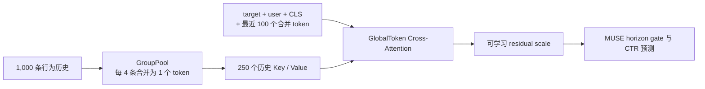

# HA-MUSE：面向简历项目的超长行为序列建模扩展

本项目基于阿里 MUSE 官方 PyTorch 实现，围绕公开 TAOBAO-MM 的 1,000 条用户历史，完成检索一致性、分组压缩、局部到全局建模和近似检索的可运行探索。英文说明和官方原始使用文档见 [README.md](README.md)，中文实验明细见 [docs/results_zh.md](docs/results_zh.md)，英文实验台账见 [docs/results.md](docs/results.md)。

## 项目定位

这是一个推荐算法实习导向的工程与实验项目，不是对 TWIN、ETA 或 LONGER 的完整论文复现。目标是在四天开发周期内建立统一、可复查的实验协议，回答三个问题：检索与精排能否共享相关性标准；完整 1K 历史能否以较低复杂度补充 MUSE 的 Top-K 兴趣；近似检索能否换取可测的检索阶段加速。

项目不支持 100K 行为序列。公开样本没有行为时间戳，因此没有实现时间间隔编码或严格的时间阶段划分。

## 理论与架构贡献

**CP-MUSE（借鉴 TWIN）**：MUSE 的 SA-TA 学习目标物品与历史行为的原始相关性分数。CP-MUSE 在完整 1K 历史的 Top-50 检索和后续目标注意力中复用同一个可训练分数，减少 GSU 与 ESU 相关性定义不一致的问题。这只是对“一致性检索”思想的轻量实现，不等同于 TWIN 的完整系统。

**LongerLite（借鉴 LONGER）**：

- GroupPool-TA 将每 4 条行为合并，把 1,000 条历史压缩为 250 个 token，再做目标注意力。
- InnerTrans-TA 在每个四行为组内独立执行一层 Transformer，复杂度随序列长度近似线性增长，不做 1K 全局平方注意力。
- GlobalToken-LongerLite 让 target、user、CLS 和最近 100 个合并 token 作为 Query，读取全部 250 个历史 Key/Value，保持“历史表征不反向读取目标”的信息方向。
- 开发阶段三个分支都通过零初始化残差接入 MUSE horizon gate 之前；最终 staged 方案改用 `residual_init=0.05`，先训练新分支再低学习率联合适配。

**ETA-CP-MUSE（借鉴 ETA）**：使用固定 seed 的 32-bit 随机投影哈希，从 1K 历史先召回 200 条，再用 CP-MUSE 共享相关性分数选 Top-50。评估时保留 exact CP 路径，用于计算 Recall@200 和同口径检索阶段耗时。

### 最终模型结构



历史 token 不读取 target 或 user，只有 Query 侧读取完整压缩历史，避免目标信息反向写入历史表征。

## 统一实验协议

- 硬件：2 x RTX 4090 24 GB，PyTorch DDP 两进程。
- 开发消融：TAOBAO-MM user-consistent 1% 划分，seed 42；所有架构从同一个 MUSE warm-up checkpoint 出发，使用匹配的 100-step 训练和 111-step 评估预算。
- staged 验证：1% 两个 seed、10% 单 seed和全量单 seed；staged 与对应 control 使用同 checkpoint、同数据顺序和匹配的 300-step 续训预算。
- 主指标：GAUC；辅助指标为 AUC、LogLoss、检索 Recall、检索阶段耗时和显存。

完整的 376-step 等学习率 continuation 从 warm-up 的 `0.584661` 下降到 `0.549213`，与 1% 数据上的过拟合现象一致，但不能据此断言过拟合是唯一原因。因此，架构对比统一采用预先固定的 100-step control，而不是选择性调整每个模型的训练预算。

## 全量结果摘要

最终验证使用 TAOBAO-MM 全部 76,015,123 行训练数据和 22,979,465 行测试数据，seed 2026，并在 2 x RTX 4090 24 GB 上运行 PyTorch DDP。control 与 staged 从同一个全量 MUSE warm-up checkpoint 出发，均继续训练 300 step，并在完整测试集上评估。

| 全量实验                | GAUC         | AUC          | LogLoss      | 相对 matched control |
| ------------------- | ------------:| ------------:| ------------:| ------------------:|
| MUSE warm-up        | **0.614801** | **0.645007** | **0.383749** | 不适用                |
| MUSE low-LR control | 0.593760     | 0.625307     | 0.411067     | 0                  |
| GlobalToken staged  | 0.597236     | 0.629558     | 0.403234     | **+0.003476**      |

GlobalToken staged 相对严格匹配的 continuation control 将 AUC 提升 `+0.004251`、LogLoss 降低 `0.007833`。它仍低于续训前的 MUSE warm-up，因此本项目的结论是“分阶段适配比直接低学习率续训更稳”，而不是“GlobalToken 超过原始 MUSE”。所有数字均为公开数据集离线结果。

### 跨 seed 与数据规模一致性

| 数据规模 | Seed | Control GAUC | Staged GAUC | Delta     |
| ---- | ----:| ------------:| -----------:| ---------:|
| 1%   | 42   | 0.578522     | 0.581907    | +0.003385 |
| 1%   | 2026 | 0.581115     | 0.584669    | +0.003554 |
| 10%  | 2026 | 0.568999     | 0.574135    | +0.005136 |
| 全量   | 2026 | 0.593760     | 0.597236    | +0.003476 |

### 开发阶段完整消融

| 实验                     | GAUC     | 相对 100-step control | 结论                       |
| ---------------------- | --------:| -------------------:| ------------------------ |
| SIM-hard               | 0.580503 | 不适用                 | 官方基线                     |
| SIM-soft               | 0.580564 | 不适用                 | 官方基线                     |
| MUSE warm-up           | 0.584661 | 不适用                 | 共同 warm-start checkpoint |
| MUSE 100-step control  | 0.583171 | 0                   | 公平架构对照                   |
| CP-MUSE                | 0.582923 | -0.000248           | 共享相关性可运行，无正向增益           |
| GroupPool-TA           | 0.582925 | -0.000246           | 完整历史压缩基线                 |
| InnerTrans-TA          | 0.582953 | -0.000218           | 局部分组建模略低于对照              |
| GlobalToken-LongerLite | 0.583169 | -0.000002           | 与对照基本持平，不能声明提升           |
| ETA-CP-MUSE            | 0.576405 | -0.006766           | 仅保留为效率权衡实验               |

GlobalToken 的 `0.583169` 与 control 的 `0.583171` 在六位小数尺度上基本持平。这个结果说明零残差的全历史分支可以稳定接入，但没有证明分支带来推荐精度增益。

ETA-CP-MUSE 的 `Recall@200=0.367484`。检索阶段耗时从 exact CP 的 `4.259 ms` 降至 `2.590 ms`，即 `1.64x` 加速、延迟降低 `39.2%`；该口径排除了两条路径共有的 embedding lookup。由于 Recall 偏低且 GAUC 降至 `0.576405`，它不是最终推荐模型，也不能表述为端到端服务加速。

基于共同 warm-up checkpoint 的纯推理候选扫描进一步验证了该权衡：K=100/200/400 分别取得 `1.91x`/`1.66x`/`1.16x` 检索阶段加速，但相对 K=1000 全候选参考分别损失 `0.008971`/`0.007665`/`0.005434` GAUC。K=800 将损失缩小到 `0.001594`，但速度已经慢于 exact CP。没有任何测试点同时满足 `GAUC 损失不超过 0.0005` 和检索加速要求。

旧的 100-step 架构相对 control 的 delta 没有达到预注册的 `+0.0005` 晋级门槛。后续 staged 300-step 实验先通过两个 seed，再完成 10% 与全量验证；该顺序遵循预注册晋级规则，避免直接为所有候选消耗全量训练预算。

## 复现

安装 PyTorch 和项目依赖后，下载并验证 TAOBAO-MM。完整数据约占 139 GB，`HF_ENDPOINT` 和 `HF_TOKEN` 可按所在网络环境自行设置：

```bash
pip install -r requirements.txt
pip install huggingface_hub
python scripts/download_taobao_mm.py --output-dir taobao-mm
python scripts/validate_dataset.py --root taobao-mm
```

先检查两卡 NCCL 通信，再运行轻量 CPU 前反向检查：

```bash
torchrun --standalone --nproc_per_node=2 scripts/ddp_smoke.py
OMP_NUM_THREADS=1 MKL_NUM_THREADS=1 PYTHONPATH=. python scripts/model_smoke.py
```

全量 warm-up、匹配 control 和 staged 可使用同一安全入口顺序执行：

```bash
NPROC_PER_NODE=2 bash scripts/run_full_pipeline.sh all
```

脚本会先校验数据，为每次运行创建带时间戳的新日志；如果只存在一半 warm-up checkpoint 会中止，完整 checkpoint 对已存在时则复用，避免覆盖。也可以分别运行 `validate`、`warmup`、`control` 或 `staged`。

官方测试集 metadata 可能把 `num_shards=48` 记录为最后 shard 索引，而目录实际包含编号 0 到 48 的 49 个文件。校验器只在所有 Parquet 总行数与 metadata 精确一致时接受这一位差并输出 warning；行数或更大的 shard 数差异仍会中止。

复现次级的 10% 一致性实验时，可按确定性用户桶分别生成 train/test 子集；输出目录应为空目录或由同一命令完整生成：

```bash
python tools/create_user_subset.py --input-dir taobao-mm/train --output-dir taobao-mm-10pct/train --mode train --modulus 10 --keep-buckets 1
python tools/create_user_subset.py --input-dir taobao-mm/test --output-dir taobao-mm-10pct/test --mode test --modulus 10 --keep-buckets 1
```

开发阶段的 1% 架构检查仍可使用分层配置。使用两张 GPU 做每个变体各 2 个训练/评估 step 的最终集成检查：

```bash
OMP_NUM_THREADS=1 torchrun --standalone --nproc_per_node=2 main.py --config config/muse_continue_short_dev.json config/cp_muse_dev.json config/final_smoke.json
OMP_NUM_THREADS=1 torchrun --standalone --nproc_per_node=2 main.py --config config/muse_continue_short_dev.json config/group_pool_dev.json config/final_smoke.json
OMP_NUM_THREADS=1 torchrun --standalone --nproc_per_node=2 main.py --config config/muse_continue_short_dev.json config/inner_trans_dev.json config/final_smoke.json
OMP_NUM_THREADS=1 torchrun --standalone --nproc_per_node=2 main.py --config config/muse_continue_short_dev.json config/global_token_dev.json config/final_smoke.json
```

复现 100-step 正式协议时移除最后的 `config/final_smoke.json`。ETA 实验将中间的变体配置替换为 `config/eta_cp_muse_dev.json`。

### GlobalToken 分阶段适配结果

为检验零初始化残差导致的新分支梯度抑制，完成了三组 300-step 等预算实验。MUSE 与 GlobalToken joint 均使用较低学习率；staged 方案将残差初始化为 `0.05`，前 75 step 只训练 `longer_lite`，后 225 step 解冻全部参数并切换到低学习率联合训练。

| 实验                  | GAUC     | 相对 MUSE control |
| ------------------- | --------:| ---------------:|
| MUSE low-LR control | 0.578522 | 0               |
| GlobalToken joint   | 0.578873 | +0.000351       |
| GlobalToken staged  | 0.581907 | +0.003385       |

staged 比 joint 高 `+0.003034` GAUC，达到预注册的 `+0.0005` 晋级门槛。在 1% 数据的 seed 2026 上，staged 相对 control 提升 `+0.003554`；在用户一致 10% 数据上提升 `+0.005136`；在 76,015,123 行全量训练数据上提升 `+0.003476`，同时 AUC 提升 `+0.004251`、LogLoss 降低 `0.007833`。结果仍不能直接表述为线上收益。


```bash
OMP_NUM_THREADS=1 torchrun --standalone --nproc_per_node=2 main.py --config config/muse_continue_short_dev.json config/muse_low_lr_300_dev.json
OMP_NUM_THREADS=1 torchrun --standalone --nproc_per_node=2 main.py --config config/muse_continue_short_dev.json config/global_token_joint_300_dev.json
OMP_NUM_THREADS=1 torchrun --standalone --nproc_per_node=2 main.py --config config/muse_continue_short_dev.json config/global_token_staged_300_dev.json
```

## 局限与负向结果

- 当前完成 1% 两个 seed、10% 单 seed 和全量单 seed 验证，不等同于线上结论。
- 没有完整实现 TWIN、ETA、LONGER，也没有复刻其工业特征、训练规模和服务系统。
- 当前数据链路只支持 1K 历史，不支持 100K；数据没有时间戳，无法验证时间间隔建模。
- 旧的 100-step 增强变体没有超过对应 control；新的 staged 300-step 结果在 1% 两个 seed、10% 单 seed 和全量单 seed 上均超过对应 control。
- ETA 的加速只覆盖检索阶段，不是端到端推理延迟；低 Recall 带来了明显 GAUC 损失。
- ETA 候选规模扫描没有找到同时满足 `GAUC 损失不超过 0.0005` 和 exact CP 加速的 operating point。
- 显存峰值来自 `nvidia-smi` 采样，不是 profiler 的精确峰值。

## 简历表述

1. 基于阿里 MUSE 构建 1K 超长行为推荐实验框架，借鉴 TWIN 统一检索与目标注意力相关性打分，并实现 GroupPool、组内 Transformer 和 GlobalToken 三类完整历史分支；在双 RTX 4090 DDP 下建立同 checkpoint、同训练预算的可复查消融协议。
2. 针对新增残差分支初期梯度抑制与主干参数干扰，设计 75-step 分支预热加 225-step 低学习率联合训练；在 TAOBAO-MM 7601 万行全量训练集上，相对同 checkpoint、同预算 continuation control 提升 GAUC `0.003476`、AUC `0.004251`，LogLoss 降低 `0.007833`。
3. 实现 ETA 风格 32-bit 哈希两阶段检索，将 Top-50 检索阶段耗时由 4.259 ms 降至 2.590 ms（1.64x），同时量化 Recall@200=0.3675 与 GAUC 下降，并依据预注册门槛停止无效扩展，保留负向实验。
