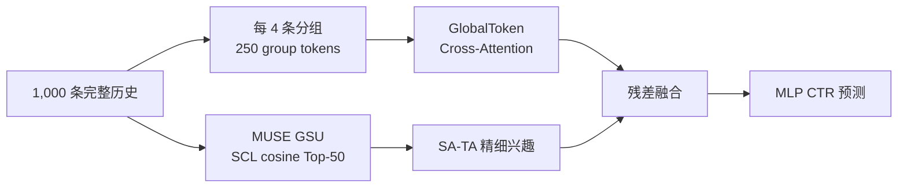
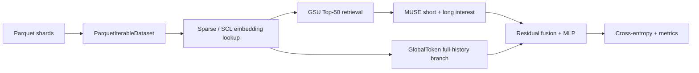

# HA-MUSE：基于全历史增强与分阶段适配的超长行为序列推荐模型

> English: **HA-MUSE: History-Augmented MUSE with Staged Adaptation for Lifelong User Interest Modeling**

本文是 HA-MUSE 项目的完整复盘与面试准备手册。项目面向推荐系统 CTR 预估场景，在阿里 MUSE 的“全历史检索 + 精细兴趣建模”框架上，引入分组压缩、GlobalToken 全历史交互和分阶段适配，目标是在可控计算复杂度下补充 Top-K 检索可能丢失的全局兴趣信息。

---

## 0. 一页项目摘要

### 0.1 一句话定义

在 TAOBAO-MM 的 1,000 长度用户行为序列上，先用 MUSE 从全历史检索与目标商品最相关的 Top-50 行为，再用轻量 GlobalToken 分支读取压缩后的完整历史，并通过“75 step 分支预热 + 225 step 低学习率联合训练”稳定接入原模型。

### 0.2 项目要解决什么

超长行为序列包含长期偏好、周期性兴趣和少量高价值行为，但直接对 1,000 甚至 100K 条行为做全局注意力，计算和显存开销过高；只做 Top-K 检索又会形成信息瓶颈。HA-MUSE 尝试在两者之间取得平衡：

1. MUSE 负责目标相关的精确兴趣抽取。
2. GlobalToken 负责保留完整历史中的低频、跨兴趣和全局上下文。
3. Staged Adaptation 负责让随机初始化的新分支稳定接入已训练主干。

### 0.3 核心工作

- 跑通 TAOBAO-MM 约 139 GB 数据、Parquet 流式读取和双卡 DDP 训练。
- 实现并比较 SIM-hard、SIM-soft、MUSE、CP-MUSE、GroupPool、InnerTrans、GlobalToken 和 ETA 风格近似检索。
- 设计 GlobalToken 全历史分支：`1,000 -> 250 group tokens -> 103 queries -> CLS interest`。
- 设计 300-step 分阶段适配，并在 1%、10% 和全量主实验上按相同 checkpoint、相同预算验证。
- 建立数据校验、两卡通信 smoke、模型前反向 smoke、结果日志和可复现流水线。

### 0.4 最重要的实验结果

全量主实验采用 seed 2026、双 RTX 4090 DDP。GlobalToken staged 相对同 checkpoint、同 300-step 预算的 MUSE low-LR control：

- GAUC：`+0.003476`
- AUC：`+0.004251`
- LogLoss：`-0.007833`

| 全量主实验 | GAUC | AUC | LogLoss |
|---|---:|---:|---:|
| MUSE warm-up checkpoint | **0.614801** | **0.645007** | **0.383749** |
| MUSE low-LR control | 0.593760 | 0.625307 | 0.411067 |
| HA-MUSE GlobalToken staged | 0.597236 | 0.629558 | 0.403234 |

这里的核心结论是：**在相同 continuation 训练条件下，完整历史分支配合分阶段适配，比仅对 MUSE 继续低学习率训练更稳定。** warm-up checkpoint 的绝对指标仍最高，因此本项目不把结果包装成“HA-MUSE 绝对超过原始 MUSE”，而是定位为一次有完整对照和跨规模证据的结构适配研究。

### 0.5 30 秒面试介绍

> 我做了一个超长行为序列推荐项目 HA-MUSE。基线是阿里的 MUSE，它先从 1,000 条用户历史中检索与目标商品最相关的 Top-50，再做语义增强的目标注意力。我发现只保留 Top-50 会形成信息瓶颈，所以增加了一个轻量 GlobalToken 分支：先每四条行为分组，把 1,000 条历史压缩成 250 个 token，再用 target、user、CLS 和最近 100 个组作为 query 读取全历史。为了避免随机初始化分支干扰预训练主干，我设计了 75 step 分支预热和 225 step 低学习率联合训练。在 TAOBAO-MM 7601 万级训练数据、双 4090 DDP 的 matched control 实验中，GAUC 提升 0.003476，AUC 提升 0.004251，LogLoss 降低 0.007833。

### 0.6 3 分钟面试介绍

> 项目背景是推荐系统里的超长行为序列建模。用户历史越来越长，DIN 这类模型直接在短序列上做目标注意力，无法充分利用长期兴趣；SIM 把问题拆成检索和精排，计算更可控，但两阶段打分不一致或 Top-K 截断都可能损失信息。MUSE 进一步使用多模态 SCL 向量做 GSU 检索，并在 ESU 中把 ID 语义与多模态相似度联合建模，是我的主基线。
>
> 我的改进分两部分。结构上，我保留 MUSE 的 Top-50 精细兴趣，同时增加完整历史分支。每条行为由 item embedding、category embedding 和 128 维 SCL 构成 160 维输入；每四条做一组，用共享局部 Transformer 压缩成 250 个 token。然后构造 target、user、CLS 和最近 100 个组共 103 个 query，通过 cross-attention 读取全部历史 token，最终取 CLS 作为全历史兴趣，通过可学习残差接到 MUSE 长期兴趣上。它的主要注意力复杂度从全局自注意力的 1000 平方，变成组内 250 乘 4 平方，加上 103 乘 250 的 cross-attention。
>
> 训练上，新分支是随机初始化的，如果和成熟主干直接联合训练，梯度会竞争；残差系数又比较小，新分支早期得到的有效监督有限。所以我把残差初始化为 0.05，前 75 step 冻结 MUSE dense 主干和 sparse embedding，只训练 GlobalToken 分支；后 225 step 解冻全模型，用 dense 5e-5、sparse 5e-4 联合适配。对照组从同一个 warm-up checkpoint 出发，训练步数和评估集完全一致。
>
> 最终在 1% 两个 seed、10% 和全量数据上，staged 相对 control 的 GAUC 都是正增益，全量提升 0.003476。同时我做了 ETA 风格 32-bit 哈希检索，检索阶段有 1.64 倍加速，但 Recall@200 只有 0.3675 且 GAUC 下降，所以没有把它合入最终方案。这个负向结果也帮助我说明了检索效率与精度之间的权衡。

---

## 1. 问题背景

### 1.1 什么是超长行为序列建模

设用户历史行为序列为

$$
\mathcal{H}_u = (b_1,b_2,\ldots,b_L),
$$

其中每个行为 $b_i$ 可以包含商品 ID、类目、多模态内容和时间等信息，$L$ 可从几百增长到几万甚至十万。给定候选商品 $a$ 和用户侧特征 $x_u$，CTR 模型学习

$$
\hat y=P(y=1\mid x_u,a,\mathcal{H}_u),
$$

其中 $y=1$ 表示点击，$y=0$ 表示未点击。

“超长”的关键并非固定阈值，而是完整序列已经无法用普通目标注意力或 Transformer 以可接受成本直接处理。在本项目中，公开数据提供最长 1,000 条行为；工业系统中的 lifelong history 可以达到 10K 到 100K 量级。

### 1.2 为什么推荐系统需要长历史

最近几十次行为擅长刻画当前意图，例如用户刚刚连续浏览跑鞋；更久的行为则包含：

- 稳定偏好：长期消费价格带、品牌和类目。
- 周期兴趣：换季、节日、复购周期。
- 低频强信号：一次重要购买可能长期影响推荐。
- 多兴趣结构：同一用户同时关注数码、运动和家居。

只看短期窗口容易过度追随近期噪声；完整历史又包含大量与当前候选无关的行为，因此问题本质是：**如何低成本地从长历史中提取目标相关信息，同时避免把全局兴趣完全截断。**

### 1.3 主要难点

1. **计算复杂度**：长度为 $L$ 的全局 self-attention 复杂度约为 $O(L^2d)$。
2. **兴趣稀释**：对 1,000 条行为直接平均，少量相关行为会被大量无关行为淹没。
3. **检索误差**：Top-K 可降低成本，但候选召回错误会成为后续模型无法修复的上限。
4. **两阶段不一致**：检索用一种相似度，精排注意力用另一种相关性，可能造成候选与下游目标错位。
5. **分布漂移**：旧行为和当前行为的语义、商品供给及用户兴趣会变化。
6. **工程负担**：稀疏 ID embedding、多模态向量、Parquet I/O、DDP shard 均衡和显存需要共同优化。

### 1.4 方法演进：DIN -> SIM -> ETA -> TWIN -> MUSE -> LONGER

#### DIN：目标注意力建模短期兴趣

DIN 使用候选商品作为 query，对用户行为做 target attention：

$$
h_u(a)=\sum_i \alpha_i(a)b_i,\qquad
\alpha_i=\operatorname{softmax}(f(a,b_i)).
$$

优点是用户表示随目标商品变化；缺点是序列很长时每个候选都要扫描全部历史，线上成本高。

#### SIM：搜索式两阶段建模

SIM 将超长历史建模拆成：

1. GSU（General Search Unit）：从完整历史快速召回 Top-K 相关行为。
2. ESU（Exact Search Unit）：对 Top-K 做更精细的目标注意力。

SIM-hard 通常用类目等规则匹配，速度快但语义粗；SIM-soft 用学习到的 embedding 相似度检索，表达力更强，但检索空间与训练稳定性要求更高。它确立了“先检索、再精排”的主流范式。

#### ETA：近似检索降低线上成本

ETA 的核心思路是把高维向量投影为二进制码，用 Hamming 距离近似语义距离，以更低成本从长历史召回候选。它强调效果与效率的平衡：哈希位数和候选规模越小，速度越快，但召回误差越大。

本项目实现了 32-bit 随机投影哈希，并量化了 Top-K Recall、检索耗时和 GAUC 损失。

#### TWIN：检索与精排相关性一致

两阶段系统常见问题是 GSU 与 ESU 使用不同打分函数。TWIN 的关键启发是让两阶段使用一致或共享的相关性表示，减小“召回认为相关、精排认为不相关”的目标偏差。

本项目的 CP-MUSE 将 GSU 检索与 SA-TA 复用可训练 relevance score，用于验证一致性打分的价值。

#### MUSE：多模态语义增强的搜索式建模

MUSE 在 SIM 两阶段框架上引入商品多模态 SCL 表征：

- GSU 使用目标商品与历史商品 SCL 向量的 cosine similarity，从 1,000 条历史选 Top-50。
- ESU 使用 SA-TA，将目标/行为的 ID 语义打分与多模态 cosine 联合建模。
- SimTier 把相似度分桶后统计频次，向 MLP 提供用户兴趣分布特征。

MUSE 的优势是让冷门或 ID 统计不足的商品也可以通过内容语义参与检索，同时保留 ID embedding 的协同过滤信息。

#### LONGER：面向超长历史的层次压缩和全局交互

LONGER 关注更长的 100K 级历史，核心启发是不能仅把完整历史当作一个被检索的候选池，还应通过层次压缩、局部建模和少量全局 token 保留跨段信息。

HA-MUSE 从中提取了三个可落地思想：

1. 按连续行为分组，降低 token 数量。
2. 组内局部 Transformer 建模短距离依赖。
3. 使用少量 GlobalToken/query 跨组读取完整历史。

### 1.5 HA-MUSE 的改进方向与目标

MUSE 的 Top-50 路径很擅长回答“历史中哪些行为和当前商品最相关”，但会丢掉 Top-50 之外的信息。HA-MUSE 保留这条强路径，同时加入完整历史摘要：



项目目标不是堆叠多个复杂模块，而是回答两个清晰问题：

1. 在 Top-K MUSE 之外增加轻量完整历史分支，能否带来稳定增益？
2. 新分支的训练方式是否比单纯增加结构更重要？

---

## 2. 数据说明

### 2.1 TAOBAO-MM 数据集

TAOBAO-MM 是阿里发布的多模态推荐数据集。项目下载后的完整目录约 139 GB，核心由训练/测试 Parquet shard、metadata 和特征映射组成。

| 数据口径 | 训练行数 | 测试行数 | 历史长度上限 |
|---|---:|---:|---:|
| 官方 metadata | 76,015,123 | 22,979,465 | 1,000 |
| 1% 用户桶 | 755,196 | 227,689 | 1,000 |
| 10% 用户桶 | 7,592,889 | 2,297,865 | 1,000 |

完整目录中发现 161 个训练 shard 和 49 个测试 shard。为保证两卡 DDP 每个 rank 分配相同 shard 数，当前 `IterableDataset` 使用可被 world size 整除的前 160/48 个 shard，对应全量主实验有效覆盖约 76,014,000/22,978,000 条样本，覆盖 metadata 的 99.998% 以上。项目中“全量实验”指这一接近完整且 DDP 对齐的主数据口径。

### 2.2 主要字段

| 字段 | 含义 | 类型/形状 |
|---|---|---|
| `label_0` | 二分类 one-hot 标签 | `list<int8>`，如 `[0,1]` |
| `129_1` | 脱敏 user ID | scalar int64 |
| `130_1` ~ `130_5` | 用户侧离散特征 | scalar int64 |
| `205` | target item ID | scalar int64 |
| `206` | target category ID | scalar int64 |
| `213`, `214` | 目标商品其他离散特征 | scalar int64 |
| `150_2_180` | 完整历史 item ID | 最长 1,000 的 list<int64> |
| `151_2_180` | 完整历史 category ID | 最长 1,000 的 list<int64> |
| SCL map | 商品多模态语义向量 | 128 维，按 item ID 查表 |

数据读取时保留最近 1,000 条历史；不足长度的样本在左侧填 0，因此序列从旧到新排列，最新行为位于右侧。短期序列直接取完整历史最后 50 条：

```python
short_item_history = full_item_history[:, -50:]
short_cate_history = full_cate_history[:, -50:]
```

### 2.3 脱敏样例

下面是便于理解的示意样例，不对应真实用户：

```json
{
  "label_0": [0, 1],
  "129_1": 782193,
  "130_1": 17,
  "130_2": 4,
  "205": 910284,
  "206": 103,
  "150_2_180": [0, 0, 0, 142, 381, 910, 733],
  "151_2_180": [0, 0, 0, 12, 103, 103, 48]
}
```

其语义是：用户 `782193` 当前曝光商品 `910284`，标签为正样本；用户过去浏览过若干商品，其中商品 `381` 和 `910` 与目标类目相同，模型需要结合近期、长期及多模态语义判断点击概率。

### 2.4 正负样本构建

项目不额外做随机负采样。正负标签由公开数据直接提供：

- `[0,1]`：正样本，表示点击。
- `[1,0]`：负样本，表示曝光未点击。

这样做避免了随机负采样改变原始曝光分布，也使 LogLoss 更接近曝光级 CTR 预估任务。若面试官问“为什么不用 in-batch negative”，可回答：当前任务是有显式曝光负样本的 pointwise CTR 二分类，不是召回阶段的对比学习；额外负采样会改变类别先验，需要重要性加权或重新校准。

### 2.5 训练、验证和测试划分

- 主实验直接使用数据集官方 train/test 划分。
- 1% 和 10% 实验用于低成本筛选，不按行随机抽样，而按 user ID 确定性分桶，从而保证同一用户不会因抽样规则在 train/test 中出现不一致口径。
- 10% 规则为：

```text
(user_id & 0x7FFFFFFFFFFFFFFF) % 10 == 0
```

项目没有单独从官方 train 再切 validation。开发阶段把 1%/10% 测试指标用于模型筛选，全量 test 用于最终离线报告。这种做法适合四天个人项目，但更严格的研究应从 train 中按时间切出 validation，并只在最终方案上查看 test。

### 2.6 数据流水线


---

## 3. 模型结构

### 3.1 输入与输出

对一个 batch，模型输入包括：

- 用户离散特征及 user ID。
- 目标商品的 item/category/其他离散特征。
- 最近 50 条短期 item/category 序列。
- 从完整 1,000 历史检索出的 Top-50 长期序列。
- 完整 1,000 条历史及对应 SCL 内容向量。
- 二分类 one-hot 标签。

模型输出为

$$
\mathbf p_i=[P(y=0),P(y=1)],
$$

线上排序通常使用 $P(y=1)$ 作为 CTR score。

### 3.2 特征表示

基础 ID embedding 维度为 $D=16$：

| 表示 | 维度 |
|---|---:|
| item ID embedding | 16 |
| category embedding | 16 |
| SCL 多模态向量 | 128 |
| 单条完整行为拼接 | 160 |
| 用户特征拼接 | 72 |

单条完整历史行为表示为

$$
e_i=[e_i^{item};e_i^{cate};e_i^{scl}]\in\mathbb R^{160}.
$$

用户向量由若干全维和半维 embedding 拼接，代码中的维度为

$$
3D+3(D/2)=72.
$$

### 3.3 MUSE 基线逐层拆解

#### 第 1 层：GSU 多模态检索

目标商品 SCL 向量为 $c_t$，历史 SCL 为 $c_i$。计算

$$
s_i^{mm}=\cos(c_t,c_i)=
\frac{c_t^\top c_i}{\lVert c_t\rVert_2\lVert c_i\rVert_2}.
$$

从 1,000 条历史取 cosine 最大的 Top-50。padding 位置通过 mask 排除，有效历史不足 50 时补位输出会被清零。

#### 第 2 层：短期兴趣分支

最近 50 条 item/category embedding 拼接为

$$
E^{short}\in\mathbb R^{50\times 2D}.
$$

目标 item/category 拼接为 query，普通 target attention 输出短期兴趣 $h_{short}$；同时保留短期序列均值作为稳定的统计表征。

#### 第 3 层：ESU 与 SA-TA

长期 Top-50 的 ID 表示作为 fact，目标商品作为 query。SA-TA 不是只看 ID dot-product，而是联合 ID 语义、多模态 cosine 和交叉项。简化写法为

$$
r_i=b_1s_i^{id}+b_2s_i^{mm}+b_3s_i^{id}s_i^{mm},
$$

$$
\alpha_i=\operatorname{softmax}(r_i),\qquad
h_{long}^{MUSE}=\sum_i\alpha_i v_i.
$$

这样既利用协同 ID 信号，也利用商品内容信号，交叉项允许模型学习两种相关性相互增强或冲突时的处理方式。

#### 第 4 层：SimTier

cosine 位于 $[-1,1]$，按 `eps=0.1` 离散为 22 档。每档统计落入的历史行为数 $n_j$，再使用

$$
z_j=\log(n_j+1)e_j^{tier}.
$$

短期和长期各得到 22 维 SimTier 特征，共 44 维。`log(count+1)` 压缩大计数，避免热门相似度区间支配 MLP。

#### 第 5 层：特征拼接与 MLP

最终拼接包含：

- 短期 attention interest。
- 长期 SA-TA interest。
- 短期/长期序列均值。
- 目标商品与用户 embedding。
- 两组 SimTier。

输入维度为

$$
15D+3(D/2)+44=308.
$$

MLP 结构：

```text
308 -> 256 -> 128 -> 64 -> 2 -> Softmax
```

隐层使用 Dice 激活。Dice 根据 batch 分布自适应控制正负区域，比固定 ReLU 更适合推荐系统中分布随特征和场景变化的输入。

### 3.4 HA-MUSE GlobalToken 分支

#### 第 1 层：分组与位置编码

完整历史 $E\in\mathbb R^{1000\times160}$ 先线性投影到 32 维，并加入绝对位置 embedding。每 4 条连续行为为一组：

$$
1000/4=250\text{ groups}.
$$

左 padding 保证末尾仍对应最近行为；mask 确保 padding 不参与均值和注意力。

#### 第 2 层：组内 Transformer

每组内独立执行一层共享 Transformer Encoder，再对有效位置做 masked mean，得到

$$
G=[g_1,\ldots,g_{250}]\in\mathbb R^{250\times32}.
$$

共享参数使模型在不同时间段上学习相同的局部组合规则。实现中将展平后的 group 分块处理，避免一次提交过多小序列触发 CUDA SDPA kernel-grid 限制。

#### 第 3 层：构造 Global Queries

共构造 103 个 query：

| Query | 数量 | 作用 |
|---|---:|---|
| target query | 1 | 读取与当前候选相关的全历史信息 |
| user query | 1 | 读取用户稳定偏好 |
| CLS query | 1 | 聚合所有 query 的全局表示 |
| recent group queries | 100 | 保留近期局部上下文并参与 query 间交互 |

即

$$
Q=[q_{target};q_{user};q_{cls};g_{151:250}].
$$

#### 第 4 层：Cross-Attention 读取完整历史

以 $Q$ 为 query，以 250 个 group token 为 key/value：

$$
\operatorname{Attn}(Q,G,G)=
\operatorname{softmax}\left(\frac{QW_Q(GW_K)^\top}{\sqrt d}\right)GW_V.
$$

随后对 query outputs 再做一层 Transformer，让 target、user、CLS 和 recent queries 交换信息。最终取索引 2 的 CLS 输出：

$$
h_{full}=H_Q[:,2]\in\mathbb R^{32}.
$$

注意信息方向：历史 token 作为 key/value 被 query 读取，但不会反向读取目标商品，从而避免把候选信息写回历史表示。

#### 第 5 层：可学习残差融合

$$
h_{long}^{HA}=h_{long}^{MUSE}+\alpha h_{full},
$$

其中 $\alpha$ 是可学习标量，初始化为 `0.05`。小残差保证刚加入随机分支时模型输出不会剧烈偏离 warm-up checkpoint；非零初始化又保证新分支从一开始能够收到梯度。

#### 参数与显存

```text
input_dim=160
model_dim=32
group_size=4
group_count=250
num_heads=1
recent_queries=100
residual_init=0.05
新增 dense 参数约 71,137
开发实验采样峰值显存约 19.69 GB/卡
```

### 3.5 为什么不直接对 1,000 条行为做 Transformer

全局 self-attention 的主要交互量为

$$
L^2=1000^2=1,000,000.
$$

HA-MUSE 的主要交互量近似为：

$$
\underbrace{250\times4^2}_{\text{组内局部注意力}}
+
\underbrace{103\times250}_{\text{Cross-Attention}}
=29,750.
$$

这里只比较 attention pair 数量，不等同于严格 FLOPs；线性投影、query Transformer 和 embedding lookup 仍有成本。但它清楚说明了层次压缩为什么能避免 $O(L^2)$ 的主瓶颈。

### 3.6 损失函数

项目使用 pointwise 二分类交叉熵：

$$
\mathcal L=-\frac1B\sum_{i=1}^B\sum_{c=0}^{1}y_{ic}\log p_{ic}.
$$

默认正式实验不依赖额外负采样或复杂辅助损失，便于把结构与训练策略的影响直接归因到主 CTR 目标。

### 3.7 一条样本如何完成前向传播

以目标商品“跑鞋”和 1,000 条用户历史为例：

1. SCL cosine 从历史中选出 50 条与跑鞋视觉/文本语义最接近的行为。
2. SA-TA 进一步根据 item/category ID 与 cosine 为这 50 条行为分配权重。
3. 最近 50 条行为形成短期兴趣，可能表达“用户最近在准备运动装备”。
4. GlobalToken 把所有 1,000 条行为压缩为 250 组，读取到“长期购买运动用品、价格敏感、近期浏览活跃”等全局信息。
5. 两条长期路径残差融合，再与用户、候选和 SimTier 特征进入 MLP。
6. 输出 `[0.18, 0.82]`，即预测点击概率为 0.82。

---

## 4. 实验细节

### 4.1 硬件和运行环境

```text
GPU: 2 x RTX 4090 24 GB
训练框架: PyTorch DDP, 2 ranks
batch_size: 1000/卡
有效 global batch: 约 2000
OMP_NUM_THREADS=1
MKL_NUM_THREADS=1
```

DDP 中每个 rank 读取互不重叠的 Parquet shard，dense 与 sparse 参数通过分布式训练同步。训练前先运行两卡 NCCL smoke，避免正式任务启动后才发现通信问题。

### 4.2 为什么采用两阶段实验漏斗

四天项目不能为每个想法都跑全量，因此采用：

```text
1% 架构筛选 -> 第二 seed -> 10% 用户一致验证 -> 全量主实验
```

只有相对 matched control 达到预设 `GAUC +0.0005` 的方案才升级。这样既控制 GPU 成本，也减少看到结果后临时挑选有利模型的风险。

### 4.3 对照组设置

#### MUSE warm-up

在全量训练数据上训练 1 epoch，得到共同父 checkpoint。关键参数：

```text
seed=2026
train steps=38,007/rank
eval steps=11,489/rank
dense_lr=2e-4
sparse_lr=2e-3
embedding_dim=16
keep_top=50
```

#### Low-LR control

从同一个 warm-up checkpoint 出发，不增加 GlobalToken，继续训练 300 step：

```text
dense_lr=5e-5
sparse_lr=5e-4
```

它是 HA-MUSE 的主要 matched control，因为新增分支也需要额外训练 300 step。若直接拿 staged 与训练前 warm-up 对比，就无法区分“结构作用”和“继续训练本身的作用”。

#### GlobalToken joint

在 1% 机制实验中，GlobalToken 从第 1 step 起与全部主干联合训练，残差同样初始化为 0.05。它用于隔离 staged schedule 的贡献。

#### GlobalToken staged

总预算同样为 300 step：

| 阶段 | Step | 可训练参数 | 学习率 |
|---|---:|---|---|
| Branch warm-up | 1-75 | 仅 `longer_lite` | dense `2e-4` |
| Joint adaptation | 76-300 | dense 主干 + sparse embedding + `longer_lite` | dense `5e-5`, sparse `5e-4` |


### 4.4 分阶段训练的理论依据

设基线输出为 $h_0$，新分支输出为 $g_\theta(x)$：

$$
h=h_0+\alpha g_\theta(x).
$$

对新分支参数的梯度为

$$
\frac{\partial\mathcal L}{\partial\theta}
=\alpha\frac{\partial\mathcal L}{\partial h}
\frac{\partial g_\theta}{\partial\theta}.
$$

当 $\alpha$ 很小时，新分支有效梯度也被缩小；如果 $\alpha=0$，除残差系数本身外，新分支第一步几乎收不到有效监督。另一方面，随机初始化分支若直接与成熟主干联合训练，主干会快速适应新噪声，可能破坏已有表示。

因此 staged schedule 同时处理两个问题：

1. 用 `alpha=0.05` 在稳定接入和有效梯度之间折中。
2. 先冻结主干，让新分支学习有意义的完整历史表示。
3. 再用低学习率联合训练，让主干与新分支完成协同校准。

这与迁移学习中的 head warm-up、渐进解冻和 residual adapter 训练具有相同优化直觉。

### 4.5 全量实验时间

根据 2026-07-31 远端日志首尾时间：

| 实验 | 开始 | 结束 | Wall-clock |
|---|---|---|---:|
| MUSE full warm-up | 02:22:59 | 04:39:31 | 约 2 h 16 min 32 s |
| MUSE low-LR control | 04:41:24 | 05:13:24 | 约 32 min |
| GlobalToken staged | 05:13:29 | 05:45:39 | 约 32 min 10 s |

每个 300-step continuation 的训练本身较短，时间主要花在完整 22,978,000 样本测试集的 11,489-step 评估。日志 QPS 的定义是 step/s，不是 samples/s。

### 4.6 工程验证

- 数据校验：metadata row count、shard 数、必需 feature map 和历史长度样例。
- DDP smoke：两 rank 初始化与 all-reduce。
- CPU smoke：GroupPool、InnerTrans、GlobalToken 的前向、反向和有限值。
- staged smoke：确认 branch-only 与 joint 切换日志都出现。
- 测试结果：远端 `35 passed`。
- 日志策略：每次正式运行使用独立文件名，不覆盖历史结果。

---

## 5. 评估指标

### 5.1 AUC

AUC 表示随机抽取一个正样本和一个负样本时，模型把正样本排在负样本前的概率：

$$
AUC=P(\hat y^+>\hat y^-).
$$

项目实现使用 200 个阈值累计 TP/FP/TN/FN，DDP all-reduce 后得到 ROC 曲线，并用梯形积分计算 AUC。它衡量全局排序能力，对类别比例相对不敏感。

### 5.2 GAUC

不同用户的点击倾向差异很大，全局 AUC 可能主要反映“高点击用户分数高于低点击用户”，而不是同一用户内部的商品排序。因此推荐系统常用 Group AUC：

$$
GAUC=\frac{\sum_{u\in U'}n_u AUC_u}{\sum_{u\in U'}n_u},
$$

其中 $U'$ 只包含同时具有正负样本的用户，$n_u$ 是该用户有效 impression 数。

当前工程实现为 batch 内按 user 分组计算 AUC，再按有效 impression 数加权并在 DDP ranks 间 all-reduce。如果同一用户跨 batch，其样本不会在全测试集层面重新聚合，因此这是高吞吐工程近似版 GAUC。对于个人简历项目足够做统一对照，但若投稿或做严格离线验收，应输出 `(user_id, label, score)` 后全局排序聚合。

### 5.3 LogLoss

$$
LogLoss=-\frac1N\sum_i[y_i\log p_i+(1-y_i)\log(1-p_i)].
$$

LogLoss 不只关心排序，还惩罚过度自信的错误预测，因此可反映概率校准。AUC 提升但 LogLoss 变差，可能说明排序变好但概率不准；本项目全量 staged 的 AUC/GAUC 上升且 LogLoss 下降，方向一致。

### 5.4 Recall@K

ETA 近似检索以 exact relevance Top-50 为参考集合 $S^*$，近似候选为 $S_K$：

$$
Recall@K=\frac{|S^*\cap S_K|}{|S^*|}.
$$

它衡量近似召回是否覆盖精确检索认为最相关的行为。Recall 高不必然带来 CTR 提升，但 Recall 过低通常会限制后续 rerank 上限。

### 5.5 延迟、吞吐和显存

- ETA 延迟使用 CUDA Event，跳过冷启动后统计检索阶段毫秒数。
- 该延迟不包含共享的 embedding lookup，也不是端到端在线 P99。
- 日志 QPS 是 step/s。
- 显存峰值来自训练期间 `nvidia-smi` 采样，不是 profiler 精确峰值。

---

## 6. 实验结果与结论

### 6.1 全量主结果

| 模型 | GAUC | AUC | LogLoss | 相对 matched control |
|---|---:|---:|---:|---:|
| MUSE warm-up | **0.614801** | **0.645007** | **0.383749** | 不适用 |
| MUSE low-LR control | 0.593760 | 0.625307 | 0.411067 | 0 |
| HA-MUSE GlobalToken staged | 0.597236 | 0.629558 | 0.403234 | GAUC `+0.003476` |

Staged 相对 control：

```text
GAUC    +0.003476
AUC     +0.004251
LogLoss -0.007833
```

**结论 1：** 在共同 checkpoint、相同 300-step 预算和相同完整测试集下，HA-MUSE 比 MUSE continuation control 更好。

**结论 2：** warm-up 本身仍是绝对最优 checkpoint，说明额外 300 step 在当前学习率和数据顺序下造成整体退化。HA-MUSE 恢复了部分退化，但没有完全抵消。因此最准确的项目主张是“改进结构适配稳定性”，不是“刷新 MUSE 绝对结果”。

### 6.2 跨 seed、跨规模一致性

| 数据规模 | Seed | Control GAUC | Staged GAUC | Delta |
|---|---:|---:|---:|---:|
| 1% | 42 | 0.578522 | 0.581907 | +0.003385 |
| 1% | 2026 | 0.581115 | 0.584669 | +0.003554 |
| 10% | 2026 | 0.568999 | 0.574135 | +0.005136 |
| 全量 | 2026 | 0.593760 | 0.597236 | +0.003476 |

四个 matched comparisons 的方向一致。虽然全量仍只有一个 seed，现有结果比单次小样本实验更能支持“staged 的效果不是偶然波动”。

### 6.3 Staged 是否真的有用

1% seed 42 的机制消融：

| 实验 | GAUC | AUC | LogLoss |
|---|---:|---:|---:|
| MUSE low-LR control | 0.578522 | 0.602126 | 0.394461 |
| GlobalToken joint | 0.578873 | 0.602621 | 0.394256 |
| GlobalToken staged | **0.581907** | **0.606298** | **0.391152** |

- staged vs control：`+0.003385` GAUC。
- joint vs control：仅 `+0.000351` GAUC。
- staged vs joint：`+0.003034` GAUC。

这说明收益不能简单归因于“多了 7 万参数”；在结构相同、残差初始化相同的情况下，训练调度是主要差异。

### 6.4 架构消融

| 架构 | GAUC | 相对 100-step control | 观察 |
|---|---:|---:|---|
| MUSE 100-step control | 0.583171 | 0 | 公平续训对照 |
| CP-MUSE | 0.582923 | -0.000248 | 一致性打分可运行，未提升精度 |
| GroupPool-TA | 0.582925 | -0.000246 | 简单分组均值不足 |
| InnerTrans-TA | 0.582953 | -0.000218 | 局部交互仍缺全局信息 |
| GlobalToken-LongerLite | 0.583169 | -0.000002 | 直接联合训练基本持平 |
| ETA-CP-MUSE | 0.576405 | -0.006766 | 检索加速带来明显精度损失 |

这组结果推动了最终方案从“继续加结构”转向“修复新分支优化过程”。

### 6.5 ETA 效率实验

32-bit 哈希 Top-200 再 rerank 到 Top-50：

```text
Recall@200 = 0.367484
exact CP retrieval = 4.259 ms
ETA shortlist + rerank = 2.590 ms
speedup = 1.64x
latency reduction = 39.2%
```

但 GAUC 下降，因此 ETA 不进入最终模型。候选规模扫描显示：候选增大时 Recall 和 GAUC 恢复，但速度优势逐渐消失，没有找到同时满足“GAUC 损失不超过 0.0005”和“快于 exact CP”的点。

### 6.6 最终结论

1. MUSE 的多模态 Top-K 路径是强基线，简单 GroupPool 或局部 Transformer 不能自动带来收益。
2. 完整历史 GlobalToken 提供了合理的补充通路，但新分支的优化策略比参数量本身更关键。
3. Staged Adaptation 在两个 seed、三个数据规模上稳定优于 matched continuation control。
4. ETA 风格近似检索验证了效果-效率冲突，当前 32-bit 随机投影配置不适合作为最终 operating point。
5. 对简历项目而言，最大的价值是形成了“问题定义 -> 理论假设 -> 小规模筛选 -> 机制消融 -> 全量验证 -> 负向结果”的完整实验闭环。

---

## 7. 缺陷与改进方向

### 7.1 当前缺陷

1. **序列仍只有 1K**：验证了超长序列方法，但没有达到 LONGER 的 100K 级规模。
2. **缺少时间戳**：无法建模行为时间间隔、兴趣周期和时间衰减。
3. **全量单 seed**：跨 seed 证据来自 1% 数据，全量重复实验仍可加强置信度。
4. **GAUC 为工程近似**：同一用户跨 batch 时没有全局聚合。
5. **测试集参与开发选择**：更严格协议应增加独立 validation。
6. **绝对最优仍是 warm-up**：staged 优于 continuation control，但没有超过训练前 checkpoint。
7. **延迟不是端到端**：ETA 只统计检索核函数，没有覆盖特征服务、embedding lookup 和网络开销。
8. **GlobalToken 仍读取 250 个 token**：若扩展到 100K 历史，需要更强的多层压缩或外部记忆。

### 7.2 P1 改进：严格解决 continuation 退化

优先增加：

- checkpoint selection 和 validation early stopping。
- 更短 continuation、cosine decay 或 layer-wise LR。
- 主干正则：L2-SP、EMA、对 warm-up logits 做 knowledge distillation。
- staged 后仅解冻高层 dense，继续冻结大规模 sparse embedding。

其中 L2-SP 可约束参数不要偏离 warm-up：

$$
\mathcal L_{total}=\mathcal L_{ctr}
+\lambda\lVert\theta_{backbone}-\theta_{warm}\rVert_2^2.
$$

### 7.3 P1 改进：更强的完整历史路由

当前 recent 100 group queries 是固定窗口。可改为：

- target-conditioned query selection。
- 多尺度分组，例如 4/16/64 三种粒度。
- 对 group token 增加门控，动态选择少量全局 token。
- 使用 Perceiver-style latent queries，使 query 数与历史长度解耦。

### 7.4 P2 改进：严格评估

- 输出全测试集 `(user_id, label, score)`，离线做严格 user-level GAUC。
- 使用 user bootstrap 给 GAUC delta 提供 95% 置信区间。
- 增加按历史长度、活跃度、冷门 item、类目一致性分桶的 slice analysis。
- 报告 end-to-end samples/s、训练显存和推理 P50/P95/P99。

个人实习项目不一定需要先完成置信区间；优先级低于第二全量 seed、validation early stopping 和严格时间切分。

### 7.5 P2 改进：更好的 ETA operating point

- 学习型哈希替代固定随机投影。
- product quantization 或 Faiss IVF/HNSW。
- 先类目 hard filter，再语义 ANN。
- 用蒸馏让近似检索拟合 exact CP relevance score。

目标是让检索近似误差与后续 CTR 目标共同优化，而不是只追求 Hamming 距离接近 cosine。

---

## 8. 高频面试问题与参考回答

### Q1：为什么这是“超长序列”，明明只有 1,000 条？

在推荐 CTR 中，每个候选都扫描 1,000 条行为已经显著增加计算和显存，尤其 batch size 达到 1,000/卡时。项目验证的是超长序列的核心矛盾和层次压缩方法；工业 100K 需要进一步增加多级压缩、缓存和 ANN，不能直接把当前实现线性放大。

### Q2：为什么用 MUSE，不直接用 Transformer？

MUSE 把计算集中在目标相关 Top-50，复杂度接近 $O(Ld+Kd^2)$，比 $O(L^2d)$ 全局 Transformer 更适合长历史；SCL 多模态向量还可以缓解冷门 item ID 表示不足。HA-MUSE 不是替换 MUSE，而是补充 Top-K 之外的全局信息。

### Q3：GlobalToken 与普通 CLS Transformer 有什么区别？

普通 CLS Transformer 让 1,001 个 token 彼此全局 self-attention。HA-MUSE 先把 1,000 条行为局部压成 250 个 token，再让固定数量 query 通过 cross-attention 单向读取历史；历史 token 不需要互相做全局交互，计算更低，也避免目标信息写回历史表征。

### Q4：为什么 group size 选 4？

这是计算与信息保真的保守折中。1,000/4 得到 250 token，显著降低全局交互，又让每组只覆盖很短的连续行为，局部 Transformer 不至于把过多不同兴趣平均在一起。更完整的实验应扫描 2/4/8/16，并按 GAUC、显存和延迟共同选择。

### Q5：为什么 recent query 是 100 个？

最近 100 个 group 覆盖约 400 条最近行为，为 GlobalToken 提供较丰富的局部上下文；同时 103 x 250 的 cross-attention 仍远小于 1000 x 1000。它是资源约束下的经验值，未来可动态路由而非固定 100。

### Q6：为什么残差初始化为 0.05，而不是 0？

零初始化最稳定，但 $\partial L/\partial\theta$ 会乘残差系数，新分支初始梯度被完全阻断。0.05 让模型输出只受到小扰动，同时新分支能获得非零梯度。joint 与 staged 都用 0.05，保证 staged 对比不混入初始化差异。

### Q7：为什么分两阶段，而不是直接联合训练？

新分支随机初始化，主干已训练成熟。直接联合训练时，主干可能先去适应随机噪声，而小残差又让新分支学习慢。先冻结主干让分支建立可用表示，再低学习率联合校准，类似迁移学习中的渐进解冻。1% 实验中 staged 比结构相同的 joint 高 0.003034 GAUC，支持这个解释。

### Q8：75/225 是如何确定的？

总预算先固定为 300 step，前 25% 用于 branch-only warm-up，后 75% 留给联合适配。这个比例是在四天项目内预先固定的低成本选择，没有做事后大规模超参搜索。若继续完善，会用 validation 比较 0/25/75/150 warm-up steps。

### Q9：为什么 control 不是 MUSE warm-up？

HA-MUSE 新分支需要额外 300 step 才能训练。如果只和训练前 checkpoint 比，结构效果与额外训练效果混在一起。matched control 也从相同 checkpoint 出发、读取相同数据、训练 300 step，唯一关键差异是是否有 GlobalToken 和 staged schedule。

### Q10：warm-up 指标更高，项目还有价值吗？

有，但结论要准确。warm-up 更高说明 continuation 配置整体退化；HA-MUSE 相对 matched control 恢复了 GAUC、AUC 和 LogLoss，并且跨 seed、跨规模方向一致。因此项目证明的是新分支及训练策略改善了下游适配稳定性。下一步应通过 early stopping、主干正则和更合适学习率争取超过 warm-up。

### Q11：GAUC 为什么比 AUC 更适合推荐？

AUC 可能利用用户间基础点击率差异；GAUC 在用户内判断正负样本排序，再按 impression 加权，更接近“给同一个用户排商品”的业务目标。项目同时报告 AUC、GAUC 和 LogLoss，分别覆盖全局排序、用户内排序和概率质量。

### Q12：你们的 GAUC 是严格的吗？

是统一可复查的工程近似：batch 内按 user 算 AUC，按有效 impression 加权，再跨 DDP all-reduce。同一用户跨 batch 时未全局合并。所有对照使用完全相同实现，因此 delta 可比较；研究级复现会落盘 score 后按用户全局聚合。

### Q13：为什么不用随机负采样？

数据已经提供曝光未点击负样本，CTR 任务要拟合真实曝光条件下的点击概率。随机负采样更适合召回训练，会改变类别先验；若使用，需要修正采样偏差并重新做概率校准。

### Q14：MUSE 的多模态信息具体在哪里起作用？

一是在 GSU 中直接用 128 维 SCL cosine 检索 Top-50；二是在 SA-TA 中作为 relevance bias 与 ID 语义打分及交叉项联合；三是 SimTier 对 cosine 分布分桶统计。它不是简单把图片向量拼到最终 MLP。

### Q15：TWIN 的思想如何体现在项目里？

CP-MUSE 让 GSU Top-K 和 ESU SA-TA 复用同一个可训练 raw relevance score，减少两阶段目标不一致。实验没有获得正向 GAUC，所以没有作为最终模型，但验证了共享打分链路和 padding-safe Top-K。

### Q16：ETA 为什么加速但掉点？

32-bit 随机投影只近似保留角度关系，Top-200 对 exact Top-50 的 Recall 只有约 0.3675，大量真正相关行为在第一阶段已经丢失，后续 CP rerank 无法恢复。候选 K 增大可以提高 Recall，但 Hamming Top-K 和 rerank 成本上升，最终失去速度优势。

### Q17：为什么不把 ETA 和 GlobalToken 一起作为最终模型？

项目优先保证一个低风险、可解释的主改进。ETA 当前 operating point 明显损失 GAUC，强行叠加会混淆 GlobalToken 的贡献，也让简历主线变散。因此它保留为效果-效率负向实验。

### Q18：如何防止 padding 影响 Top-K 和 attention？

padding item ID 为 0，构造 `valid_mask = history_item != 0`。检索前将无效位置 score 置为负无穷；group pooling 只统计有效 token；attention 使用 key padding mask；全 padding 样本使用安全占位避免 softmax NaN，最终输出再清零。

### Q19：为什么每卡 batch 可以到 1000？

MUSE 主路径只对 Top-50 做精细注意力；GlobalToken 把 1,000 历史投影到 32 维并按四条分组。模型 dense 参数较小，主要内存来自 embedding 和中间序列表示。双 4090 上开发实验峰值约 19.69 GB/卡，仍在 24 GB 内。

### Q20：DDP 如何划分数据？

`IterableDataset` 先把 shard 索引按 `i % world_size == rank` 分给 rank，再在 rank 内按 worker ID 分配。shard 数先截断到 world size 的整数倍，避免一个 rank 提前耗尽导致 collective hang。随机种子还叠加 epoch、rank 和 worker ID。

### Q21：项目中最难的工程问题是什么？

三个典型问题：完整数据下载重建；10% 数据 DDP 尾部 batch 不一致导致 rank 等待；InnerTrans 一次提交约 25 万个小组触发 CUDA SDPA kernel-grid 限制。解决方式分别是可恢复下载与校验、限制到两 rank 共同可用 step、按最多 50,000 个组分块执行共享 Transformer。

### Q22：如果再给一周，你最先做什么？

先增加独立 validation 和 early stopping，解决 continuation 退化；再跑全量第二 seed；随后做 group size、warm-up steps 和冻结范围三个小型消融。若仍有时间，再实现严格 user-level GAUC 和按历史长度分桶分析。

---

## 9. 项目相关八股

### 9.1 DIN、SIM、双塔和序列 Transformer 的区别

- 双塔：用户/商品独立编码，适合大规模召回，但交叉特征有限。
- DIN：候选条件化地聚合短期历史，适合 CTR 精排。
- SIM/MUSE：先从超长历史检索 Top-K，再做精细 target attention。
- 序列 Transformer：行为间交互能力强，但长序列成本高，常需稀疏注意力或层次压缩。

### 9.2 稀疏特征为什么用 embedding

高基数 ID one-hot 维度极大。Embedding lookup 等价于选取可训练矩阵的一行，将离散实体映射到低维空间；相似上下文中的 ID 可通过梯度学习相近表示。

### 9.3 Dice 激活

Dice 根据输入的归一化分布估计门控概率：

$$
Dice(x)=p(x)x+(1-p(x))\alpha x.
$$

它是数据自适应激活，在推荐场景中比固定零阈值的 ReLU 更能适应分布变化。

### 9.4 Attention 的本质

Attention 是可微的加权检索：query 表示当前信息需求，key 用于相关性匹配，value 是被聚合的内容。target attention 让同一用户面对不同候选商品产生不同兴趣表示。

### 9.5 Self-Attention 与 Cross-Attention

- Self-attention：Q/K/V 来自同一序列，建模序列内部关系。
- Cross-attention：Q 来自目标或 latent tokens，K/V 来自历史，用固定 query 数读取长上下文。

### 9.6 DDP 与 DataParallel

DDP 每张 GPU 一个进程，反向时通过 all-reduce 同步梯度，通常比单进程 DataParallel 更高效。数据必须保证各 rank step 数一致，否则某个 rank 提前结束会让其他 rank 卡在 collective。

### 9.7 AUC、GAUC 和 NDCG 的适用场景

- AUC：二分类全局 pairwise 排序。
- GAUC：用户/请求组内 AUC，CTR 常用。
- NDCG：考虑位置折扣和多级相关性，列表排序常用。
- Recall@K：召回阶段覆盖率。

### 9.8 过拟合与灾难性遗忘

continuation 指标下降可能来自过拟合、学习率过大、训练/测试分布差异、数据顺序或主干对新分支噪声的适应。只凭一条曲线不能断言唯一原因。可通过 validation curve、冻结主干、参数距离正则和多 seed 区分。

---

## 10. 简历与面试表述

### 10.1 推荐项目名称

**HA-MUSE：基于全历史增强与分阶段适配的超长行为序列推荐模型**

### 10.2 三条简历 bullet

1. 基于阿里 MUSE 搭建 1K 超长行为 CTR 预估框架，完成 TAOBAO-MM 约 139 GB 数据校验、Parquet 流式加载及双 RTX 4090 DDP 训练，并复现 SIM-hard/soft 与多模态 Top-K 搜索式兴趣建模链路。
2. 设计 HA-MUSE 全历史分支，将 1,000 条行为经组内 Transformer 压缩为 250 个 token，由 target/user/CLS/recent queries 执行 Cross-Attention；以约 7.1 万新增 dense 参数补充 MUSE Top-50 的全局信息瓶颈。
3. 针对随机分支梯度抑制和主干参数干扰，设计 75-step 分支预热 + 225-step 低学习率联合适配；在 7601 万级训练数据的 matched control 实验中提升 GAUC `0.003476`、AUC `0.004251`，LogLoss 降低 `0.007833`，并在 1% 双 seed、10% 与全量实验中获得一致正向 delta。

可选效率 bullet：

> 实现 ETA 风格 32-bit 哈希召回与 CP rerank，使检索阶段从 4.259 ms 降至 2.590 ms（1.64x），并通过 Recall@200 与 GAUC 消融识别近似检索精度瓶颈，依据预设门槛停止负收益方案。

### 10.3 面试表述边界

可以说：

- “在全量主实验上相对同 checkpoint、同预算 MUSE control 提升 GAUC 0.003476。”
- “借鉴 TWIN 的一致性打分、ETA 的近似检索和 LONGER 的层次化全历史建模。”
- “完成 1% 双 seed、10% 和全量验证。”

不要说：

- “线上 CTR 提升 0.35%”——离线 GAUC delta 不能换算成线上 CTR。
- “复现了工业级 LONGER 100K 系统”——当前历史长度是 1K。
- “HA-MUSE 超过原始 MUSE”——当前绝对最好的是 warm-up checkpoint。
- “端到端推理加速 1.64x”——该数字仅是 ETA 检索阶段。

---

## 11. 项目结构与代码导航

### 11.1 关键文件

| 文件 | 作用 |
|---|---|
| `model/muse.py` | MUSE 主干、GlobalToken 接入和 CTR loss |
| `model/base_model/longer_lite.py` | GroupPool、InnerTrans、GlobalToken |
| `model/base_model/layers.py` | SA-TA、共享 relevance score、MLP |
| `model/base_model/simtier.py` | cosine 分桶统计 |
| `trainer.py` | 检索、staged controller、训练与指标 |
| `utils/muse_dataset.py` | Parquet 流式数据集与 DDP shard 分配 |
| `utils/hash_retrieval.py` | ETA 风格 Hamming 检索与 Recall |
| `scripts/validate_dataset.py` | 数据完整性校验 |
| `scripts/run_full_pipeline.sh` | 全量校验、warm-up、control、staged 流水线 |
| `docs/results_zh.md` | 完整实验日志与结果表 |

### 11.2 目录结构

```text
ha-muse/
├── model/                 # MUSE 主模型和基础网络层
│   └── base_model/        # Attention、SimTier、GlobalToken 等组件
├── utils/                 # 数据集、特征处理、指标和检索工具
├── config/                # 各基线、消融和全量实验参数
├── scripts/               # 数据校验、smoke 和实验流水线
├── tools/                 # 用户一致子集生成等离线工具
├── tests/                 # 关键模块和训练阶段切换测试
├── docs/                  # 计划、实验结果和项目复盘文档
├── main.py                # 配置合并、DDP 初始化和实验入口
└── trainer.py             # 训练、评估、检索与指标聚合
```

### 11.3 一次训练的数据流



`main.py` 根据多份 JSON 配置构造数据、dense 模型和 sparse embedding；`trainer.py` 将完整历史变成短期窗口、Top-50 检索结果和 GlobalToken 输入，并控制 staged 的冻结/解冻；`model/muse.py` 完成兴趣融合与 CTR 预测；评估阶段再由 `trainer.py` 跨两张 GPU 聚合 AUC、GAUC 和 LogLoss。

---

## 12. 项目复盘

### 12.1 做得好的地方

- 没有停在小数据 demo，而是完成 7601 万级训练数据和完整测试集评估。
- 所有核心比较从共同 checkpoint 出发并匹配训练预算。
- 从“架构未提升”继续追查到“训练适配问题”，再用 joint/staged 消融验证。
- 保留 ETA 等负向结果，能够讲清楚停止依据。
- 代码、配置、日志、数据校验和复现入口形成闭环。

### 12.2 可以做得更好的地方

- 在正式全量实验前就建立独立 validation 和 early stopping。
- 更早记录 profiler 级显存、端到端吞吐和准确 wall-clock。
- 对 full shard DDP 对齐口径在 README 中一开始就说明。
- 将严格 GAUC 作为离线结果脚本，而不是训练期间维护复杂状态。

### 12.3 最终项目故事

这个项目不是“把几个论文名拼在一起”，而是一条可复述的工程研究链路：

1. MUSE 通过 Top-K 检索解决长序列计算问题。
2. Top-K 又造成完整历史信息瓶颈。
3. 层次分组和 GlobalToken 以较低复杂度补充全历史。
4. 初版结构没有提升，说明结构可用不等于优化充分。
5. 梯度分析指向小残差和随机分支适配问题。
6. Staged Adaptation 在 joint 对照、双 seed、10% 和全量上得到一致证据。
7. ETA 实验进一步展示了系统中的效果-效率权衡。

这套叙事既能体现推荐算法理解，也能体现数据工程、分布式训练、实验设计和结果边界意识。

---

## 参考资料

1. MUSE: [arXiv:2512.07216](https://arxiv.org/abs/2512.07216)
2. TAOBAO-MM: [https://taobao-mm.github.io/](https://taobao-mm.github.io/)
3. LONGER: [arXiv:2505.04421](https://arxiv.org/pdf/2505.04421)
4. MUSE 中文技术解读：[知乎文章](https://zhuanlan.zhihu.com/p/1985082395104392768)
5. LONGER 中文技术解读：[知乎文章](https://zhuanlan.zhihu.com/p/1936870762523890492)
6. SIM: *Search-based User Interest Modeling with Lifelong Sequential Behavior Data for CTR Prediction*
7. DIN: *Deep Interest Network for Click-Through Rate Prediction*
